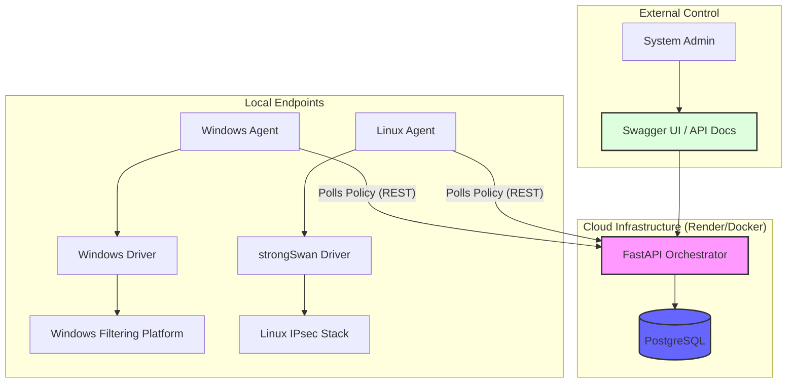

# Unified Cross-Platform IPsec Framework

[](https://opensource.org/licenses/MIT)
[](https://www.python.org/downloads/)
[](https://fastapi.tiangolo.com/)
[](https://www.docker.com/)

A professional, enterprise-grade framework designed to standardize, automate, and orchestrate IPsec tunnel configurations across heterogeneous operating systems (Windows, Linux, and macOS).

---

## 🏗 Architecture & Flow



## 📋 Project Status
- [x] **Core Orchestrator**: FastAPI backend with PostgreSQL persistence
- [x] **Containerization**: Full Docker support for cloud deployment (Render, Vercel)
- [x] **Platform Drivers**: Native Windows (PowerShell) and Linux (strongSwan) support
- [x] **Admin Dashboard**: React.js frontend with policy management
- [x] **Phase 1 - Compliance & Telemetry** (✅ Complete):
  - [x] Heartbeat monitoring (device health & connectivity)
  - [x] Compliance reporting (policy adherence verification)
  - [x] Security Association (SA) monitoring (IPsec tunnel tracking)
  - [x] Leak detection (unauthorized data flow alerts)
  - [x] Audit logs with immutable chain integrity (SHA-512)
- [x] **Phase 2 - Full Zero Trust Security** (✅ Complete):
  - [x] Internal Certificate Authority (CA) for device certificates
  - [x] mTLS communication (mutual TLS authentication)
  - [x] Device fingerprint attestation (HMAC-SHA512)
  - [x] JWT token management with automatic rotation
  - [x] Admin TOTP MFA (Time-based One-Time Passwords)
  - [x] Behavioral trust scoring (continuous device evaluation)
  - [x] Zero Trust middleware (threshold-based access control)
  - [x] Rate limiting on all endpoints (DoS protection)
- [x] **Phase 3 - Policy Routing & Driver Dispatch** (✅ Complete):
  - [x] Policy parser with alias normalization and validation
  - [x] Per-OS policy config generation (Linux / Windows / macOS)
  - [x] OS-specific device config delivery
  - [x] Native driver dispatch on agents
- [ ] **macOS Support**: Upcoming integration with native IPsec APIs

### Completed Changes So Far
- Windows policy application now uses a staged PowerShell driver flow with explicit step logging.
- PSK IKEv2 Windows tunnels now skip Phase 2 auth set creation when it is not applicable.
- Quick mode proposal generation now uses Windows-supported parameters only.
- The policy parser now normalizes crypto values into Windows-accepted names before dispatch.
- The documentation set now includes the Windows runbook, policy routing guide, and a navigation index.

---

## 🚀 Quick Start

### 1. Cloud Deployment (The "Brain")
Deploy the Central Orchestrator to **Render** in minutes:
- **Render Deployment**: [DEPLOYMENT_VERCEL.md](docs/DEPLOYMENT_VERCEL.md)
- **Linux Deployment**: [DEPLOYMENT_LINUX.md](docs/DEPLOYMENT_LINUX.md)
- **Interactive API Docs**: Access `/docs` on your orchestrator to manage policies

### 2. Local Setup (The "Hands")
Set up agents on your local machines:
- **Complete Usage Guide**: [USAGE_GUIDE.md](docs/USAGE_GUIDE.md) - Start here for step-by-step instructions
- **Agent Enrollment**: [AGENT_REGISTRATION.md](docs/AGENT_REGISTRATION.md) - How to register new devices
- **Windows Agent Runbook**: [AGENT_WINDOWS_RUNBOOK.txt](docs/AGENT_WINDOWS_RUNBOOK.txt) - Exact env vars and commands for a fresh PowerShell session

### 3. Security & Advanced Topics
- **Zero Trust Architecture**: [ZERO_TRUST_SETUP.md](docs/ZERO_TRUST_SETUP.md) - Complete Zero Trust implementation
- **Compliance & Monitoring**: [COMPLIANCE_AND_MONITORING.md](docs/COMPLIANCE_AND_MONITORING.md) - Heartbeat, SA monitoring, leak detection
- **Policy Routing & Drivers**: [POLICY_ROUTING_AND_DRIVERS.md](docs/POLICY_ROUTING_AND_DRIVERS.md) - Policy parsing and OS-specific dispatch
- **Security Architecture**: [SECURITY_ARCHITECTURE.md](docs/SECURITY_ARCHITECTURE.md) - Cryptography, threat models, incident response

### 4. Windows Driver Notes (Completed)
- Windows dispatcher now applies tunnel policy using a staged PowerShell flow with explicit step logging.
- For PSK IKEv2 tunnels, Phase 2 auth set creation is skipped.
- Quick mode proposal uses Windows-supported parameters (`Encapsulation`, `ESPHash`, `Encryption`).
- Rule creation enforces inbound and outbound security requirements.
- See [AGENT_WINDOWS_RUNBOOK.txt](docs/AGENT_WINDOWS_RUNBOOK.txt) for exact terminal commands and verification steps.

---

## 💻 Tech Stack

### Backend & Core
*   **Framework**: Python 3.10+, FastAPI 0.100+, SQLAlchemy ORM
*   **Database**: PostgreSQL (cloud deployments), SQLite (local dev)
*   **Deployment**: Docker, Render, Vercel
*   **API Docs**: OpenAPI/Swagger at `/docs`

### Security (Phase 1 & 2)
*   **Encryption**: AES-GCM-256 (IPsec), AES-256-GCM (TLS), RSA-4096 (device certs)
*   **Hashing**: SHA-512 (audit trail, fingerprints), SHA-256 (JWT)
*   **Authentication**: 
  - Admin: Username + Password + TOTP MFA
  - Devices: Fingerprint + HMAC-SHA512 + X.509 certificate
*   **mTLS**: Client certificate verification on all device endpoints
*   **Rate Limiting**: slowapi (DoS protection on all endpoints)
*   **Token Management**: RS256 JWT (15-min access + 7-day refresh)
*   **Password Security**: bcrypt with work factor 12

### Agent
*   **Lightweight**: Python residents with minimal dependencies
*   **Platforms**: Windows (PowerShell), Linux (strongSwan)
*   **Compliance**: Heartbeat, SA monitoring, leak detection, OS-specific policy enforcement
*   **Communication**: mTLS client with automatic retry + backoff

### Frontend
*   **Dashboard**: React.js with Vite bundler
*   **UI Framework**: Modern responsive design
*   **Features**: 
  - Device management and enrollment
  - Policy creation and assignment
  - Real-time monitoring (heartbeat, SA status)
  - Compliance dashboard
  - Audit log viewer
  - Admin security settings (TOTP MFA setup)

---

## 📂 Directory Structure
```text
├── agent/                  # Device Agent logic
│   ├── client.py          # Orchestrator API client
│   ├── main.py            # Agent main loop with mTLS support
│   ├── config.py          # Environment-driven configuration
│   ├── security/          # Security modules
│   │   ├── device_fingerprint.py  # Device identity & attestation
│   │   └── mtls_client.py         # Secure mTLS HTTP client
│   ├── verification/      # Compliance verification
│   │   └── sa_monitor.py  # IPsec SA monitoring & leak detection
│   ├── platforms/         # OS-specific drivers
│   │   ├── base.py        # Base platform interface
│   │   ├── windows.py     # Windows PowerShell integration
│   │   └── linux.py       # Linux strongSwan integration
│   └── utils/             # Utility functions
│
├── orchestrator/          # Central Orchestrator service
│   ├── main.py           # FastAPI app initialization
│   ├── models.py         # SQLAlchemy ORM models
│   ├── schemas.py        # Pydantic request/response schemas
│   ├── auth.py           # Authentication & authorization
│   ├── config.py         # Configuration management
│   ├── database.py       # Database connection pooling
│   ├── security/         # Security modules
│   │   ├── certificate_authority.py  # Internal CA for device certs
│   │   ├── token_manager.py          # JWT access & refresh tokens
│   │   ├── totp_manager.py           # Admin TOTP MFA
│   │   └── trust_evaluator.py        # Zero Trust scoring
│   ├── middleware/       # Request middleware
│   │   └── zero_trust.py # mTLS verification & trust enforcement
│   ├── routers/          # API endpoint handlers
│   │   ├── auth.py       # User authentication endpoints
│   │   ├── devices.py    # Device enrollment & management
│   │   ├── policies.py   # IPsec policy management
│   │   └── compliance.py # Compliance & monitoring endpoints
│   ├── services/         # Business logic services
│   ├── models/           # Database model extensions
│   │   └── certificate.py # Device certificate ORM tables
│   ├── schemas/          # Extended Pydantic schemas
│   │   └── compliance.py # Compliance request/response schemas
│   ├── frontend/         # React.js admin dashboard
│   │   ├── src/          # React components
│   │   ├── index.html    # HTML entry point
│   │   ├── package.json  # Node dependencies
│   │   └── vite.config.js # Vite build config
│   └── generate_keys.py  # Key pair generation utility
│
├── docs/                  # Documentation
│   ├── INDEX.md                    # Documentation navigation index
│   ├── USAGE_GUIDE.md              # Complete usage guide (START HERE)
│   ├── ZERO_TRUST_SETUP.md         # Zero Trust architecture deep dive
│   ├── COMPLIANCE_AND_MONITORING.md # Phase 1 telemetry & monitoring
│   ├── SECURITY_ARCHITECTURE.md    # Cryptography & threat models
│   ├── POLICY_ROUTING_AND_DRIVERS.md # Policy parser and native driver behavior
│   ├── API_TESTING_GUIDE.md        # API validation and endpoint testing
│   ├── AGENT_REGISTRATION.md       # Device enrollment guide
│   ├── AGENT_WINDOWS_RUNBOOK.txt   # Windows agent env vars and command sequence
│   ├── DEPLOYMENT_LINUX.md         # Linux deployment instructions
│   └── DEPLOYMENT_VERCEL.md        # Vercel/Render deployment
│
├── keys/                  # Cryptographic keys (not in repo)
│   ├── ca.crt            # CA public certificate
│   └── ca.key            # CA private key (KEEP SECURE!)
│
├── shared/                # Shared utilities
├── Dockerfile             # Container definition for Orchestrator
├── render.yaml            # Render infrastructure-as-code
├── LICENSE                # MIT License
├── README.md              # This file
└── TEST_PLAN.md           # Comprehensive test strategies
```

---

## 🤝 Contributing
Contributions are welcome! Please follow the standard fork/PR workflow.

## 📄 License
Distributed under the MIT License. See `LICENSE` for details.
