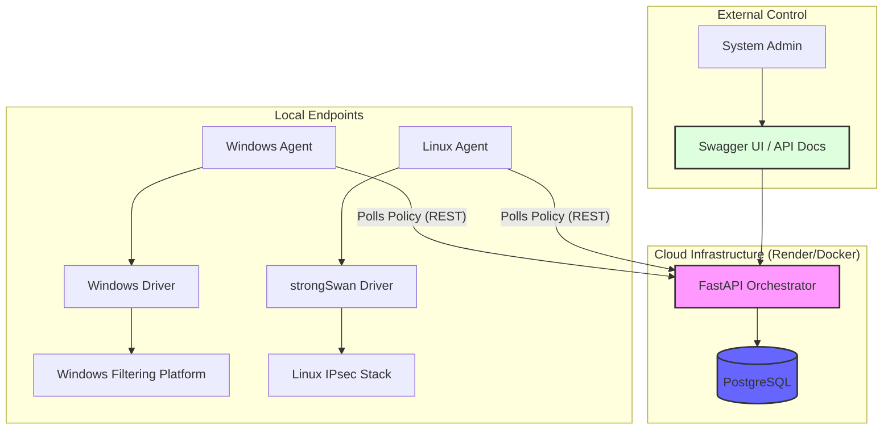

# Unified Cross-Platform IPsec Framework

[](https://opensource.org/licenses/MIT)
[](https://www.python.org/downloads/)
[](https://fastapi.tiangolo.com/)
[](https://www.docker.com/)

A professional, enterprise-grade framework designed to standardize, automate, and orchestrate IPsec tunnel configurations across heterogeneous operating systems (Windows, Linux, and macOS).

---

## 🏗 Architecture & Flow



## 📋 Project Status
- [x] **Core Orchestrator**: FastAPI backend with Swagger docs.
- [x] **Persistence**: PostgreSQL integration for cloud deployment.
- [x] **Containerization**: Full Docker support for the Orchestrator.
- [x] **Platform Drivers**: Native support for Windows (PowerShell) and Linux (strongSwan).
- [ ] **macOS Support**: Upcoming integration.

---

## 🚀 Quick Start

### 1. Cloud Deployment (The "Brain")
Deploy the Central Orchestrator to **Render** in minutes using the provided Blueprint:
- **Guide**: [Render Deployment Guide](.gemini/antigravity/brain/98ab75a3-4827-40e4-8942-4410cf362c23/DEPLOYMENT_GUIDE_RENDER.md)
- **Interactive Docs**: Access `/docs` on your deployed URL to manage policies via Swagger UI.

### 2. Local Setup (The "Hands")
To startEstablishing tunnels on your local machines:
- **Windows**: [Windows Agent Setup](.gemini/antigravity/brain/98ab75a3-4827-40e4-8942-4410cf362c23/AGENT_SETUP_GUIDE.md#windows-setup)
- **Linux**: [Linux Agent Setup](.gemini/antigravity/brain/98ab75a3-4827-40e4-8942-4410cf362c23/AGENT_SETUP_GUIDE.md#linux-setup)

---

## 💻 Tech Stack
*   **Orchestrator**: Python 3.10+, FastAPI, SQLAlchemy, PostgreSQL.
*   **Agent**: Lightweight Python residents with OS-native drivers.
*   **Infrastructure**: Docker, Render Blueprints.
*   **Security**: IKEv2 (IKEv2 Focused), AES-GCM, SHA-2.

---

## 📂 Directory Structure
```text
├── agent/                  # Device Agent logic
├── orchestrator/           # Central Orchestrator service
├── .dockerignore           # Optimized Docker build context
├── Dockerfile              # Container definition for Orchestrator
├── render.yaml             # Render infrastructure-as-code
└── README.md               # Overview and status
```

---

## 🤝 Contributing
Contributions are welcome! Please follow the standard fork/PR workflow.

## 📄 License
Distributed under the MIT License. See `LICENSE` for details.
