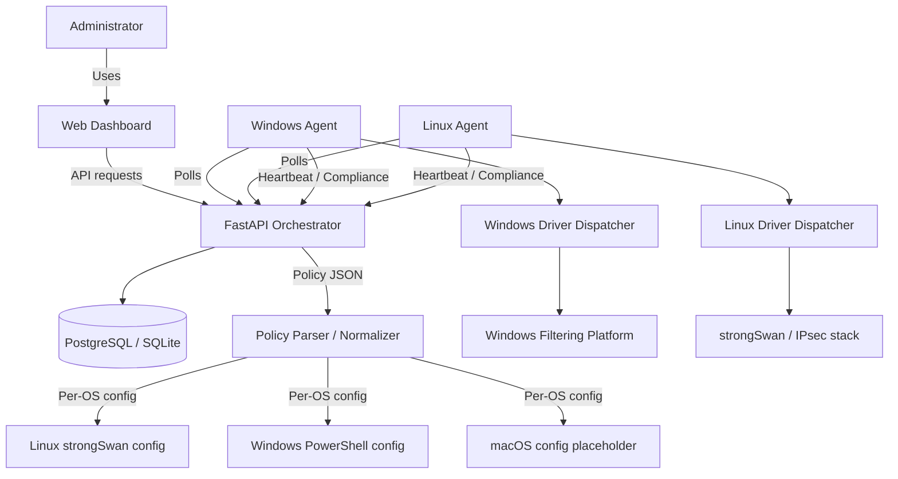

# IPSec Framework Universal Documentation

This file is a local consolidation of the project documentation. It combines the architecture, workflow, enrollment, policy routing, compliance, security, deployment, and operational notes into one report-friendly reference.

---

## 1. Executive Summary

The Unified Cross-Platform IPsec Framework is a Python-based orchestration platform for managing IPsec tunnel policy across Windows, Linux, and planned macOS agents. The system is built around a central FastAPI orchestrator, local agents that poll for policy, and OS-specific drivers that apply the correct native configuration on each endpoint.

The current documented state includes:

- A working orchestrator with API, database persistence, and dashboard support.
- Native Windows PowerShell and Linux strongSwan driver support.
- Phase 1 compliance and telemetry.
- Phase 2 Zero Trust security controls.
- Phase 3 policy parsing, normalization, OS-specific config generation, and driver dispatch.
- A Windows runbook that captures the exact environment setup and execution flow.

---

## 2. Architecture Overview

### Core Model

The system is organized around three major roles:

- The Brain: the central orchestrator that stores policy, manages identity, and serves config.
- The Hands: local agents on each managed device that poll for policy and apply it.
- The Drivers: platform-specific execution layers that translate policy into native OS actions.

### Architecture Diagram

### Request Flow

The request path is intentionally centralized and deterministic:

1. The administrator defines the policy once.
2. The orchestrator validates it and stores the canonical version.
3. The agent polls for the latest assignment.
4. The orchestrator returns a platform-specific payload.
5. The dispatcher maps that payload to the local OS driver.
6. The agent reports result state back to the orchestrator.

### Deployment View

- Control plane: orchestrator, database, and dashboard.
- Data plane: endpoint agents and native OS networking stacks.
- Security plane: certificates, tokens, trust scoring, and audit logging.

### High-Level Flow

1. An administrator defines and uploads a policy.
2. The orchestrator validates and normalizes the policy.
3. The agent polls the orchestrator for device-specific instructions.
4. The agent receives an OS-specific config block.
5. The native driver applies the policy locally.
6. The agent reports heartbeat, compliance, and SA state back to the orchestrator.

### Main Components

- `orchestrator/`: FastAPI backend, auth, models, policy services, compliance routers, and configuration.
- `agent/`: device-side client, driver dispatcher, platform implementations, and utility logic.
- `orchestrator/frontend/`: React dashboard for device and policy administration.
- `docs/`: operational and architectural documentation.

### Key Runtime Objects

- Device identity: enrollment number, fingerprint, certificate, and trust score.
- Policy record: uploaded JSON, parse warnings, hash, and target OS payloads.
- Compliance record: heartbeat, SA state, policy adherence, and leak indicators.
- Session credentials: access tokens, refresh tokens, and revocation state.

### Important Files by Responsibility

- `orchestrator/main.py`: API startup and middleware registration.
- `orchestrator/services/`: policy and business logic.
- `orchestrator/routers/`: HTTP endpoints for auth, devices, policies, and compliance.
- `agent/main.py`: enrollment and polling loop.
- `agent/drivers/dispatcher.py`: OS dispatch and staged application flow.
- `agent/platforms/`: Windows and Linux platform-specific implementations.

---

## 3. Project Status

### Completed

- Core orchestrator with PostgreSQL persistence.
- Containerization support for cloud deployment.
- Windows and Linux platform drivers.
- Admin dashboard for policy management.
- Phase 1 compliance and monitoring.
- Phase 2 Zero Trust controls.
- Phase 3 policy routing and driver dispatch.

### In Progress or Planned

- macOS support is still listed as upcoming.

---

## 4. Documentation Index

### Primary Guides

- `README.md`: top-level project overview and quick links.
- `docs/INDEX.md`: documentation navigation hub.
- `docs/USAGE_GUIDE.md`: complete end-to-end operational guide.
- `docs/AGENT_WINDOWS_RUNBOOK.txt`: exact Windows PowerShell startup and run sequence.

### Security and Architecture

- `docs/ZERO_TRUST_SETUP.md`: Zero Trust implementation details.
- `docs/SECURITY_ARCHITECTURE.md`: cryptography, threat model, and security layers.
- `docs/COMPLIANCE_AND_MONITORING.md`: heartbeat, compliance, SA tracking, leak detection, and audit logs.

### Policy and Driver Behavior

- `docs/POLICY_ROUTING_AND_DRIVERS.md`: policy parsing, alias normalization, and native driver dispatch.

### Deployment and Onboarding

- `docs/AGENT_REGISTRATION.md`: two-step device onboarding flow.
- `docs/DEPLOYMENT_LINUX.md`: Linux deployment guide.
- `docs/DEPLOYMENT_VERCEL.md`: frontend deployment guide for Vercel.

---

## 5. End-to-End Workflow

### 5.1 Initial Setup

The orchestrator is started first, then the dashboard, then agents are enrolled on managed endpoints.

Typical setup sequence:

1. Configure environment variables.
2. Install dependencies.
3. Initialize the database.
4. Seed the admin account.
5. Start the FastAPI orchestrator.
6. Open the dashboard.
7. Register devices and activate agents.

### 5.2 Policy Creation and Delivery

1. The administrator creates or uploads an IPsec policy.
2. The orchestrator validates the payload.
3. Crypto aliases are normalized to OS-supported values.
4. The policy is stored along with parse warnings and traceability data.
5. Each agent receives a config tailored to its target operating system.

### 5.3 Agent Application

1. The agent authenticates using the enrollment flow.
2. The agent requests configuration updates.
3. The dispatcher selects the correct OS-specific implementation.
4. The driver applies the local configuration.
5. The agent sends back health and compliance telemetry.

### 5.4 Operational Lifecycle

The system is not one-time setup software; it is a recurring control loop.

- New policies may be uploaded at any time.
- Agents detect policy changes on the next poll cycle.
- Existing devices retain identity while receiving new policy versions.
- Compliance and SA monitoring continuously validate tunnel state.

### 5.5 Windows Runtime Sequence

The Windows path now behaves as a staged PowerShell sequence:

1. Clear stale objects from the local IPsec store.
2. Create the Phase 1 auth set.
3. Map DH and crypto values into Windows-supported names.
4. Skip unsupported Phase 2 auth creation for PSK IKEv2 flows.
5. Build the quick mode crypto proposal with supported parameters only.
6. Create the tunnel and main mode rules.
7. Confirm the rule state and return success to the orchestrator.

### 5.6 Linux Runtime Sequence

The Linux path follows the strongSwan model:

1. Pull policy from the orchestrator.
2. Render the local configuration file.
3. Load the configuration into the IPsec stack.
4. Verify the SA state.
5. Report compliance and heartbeat data.

---

## 6. Agent Registration and Device Enrollment

### Two-Step Onboarding

The onboarding process is intentionally split into two parts:

1. Pre-register the device in the dashboard.
2. Run the local agent on the target device.

### Dashboard Pre-Registration

The administrator provides:

- Enrollment number.
- Enrollment token.
- Pre-shared key, usually matching the enrollment token.

The device is created in a pending state until the local agent enrolls successfully.

### Windows Agent Enrollment

The Windows flow is documented as a fresh PowerShell session with:

- Execution policy set for the process scope.
- Repository root selected.
- Virtual environment activated.
- Orchestrator URL and poll interval configured.
- Optional interface fallback warning suppressed if needed.
- Agent launched from the `agent` directory.

The runbook exists because the Windows flow is sensitive to terminal state and environment setup. It captures the exact sequence needed to reproduce a clean enrollment session.

### Linux Agent Enrollment

Linux uses a similar agent model but typically requires root or sudo privileges to apply IPsec configuration through strongSwan.

### Verification

After enrollment, the device should transition from pending to active in the dashboard, and subsequent heartbeats should confirm continued connectivity.

### Common Enrollment Data

- Enrollment number: human-readable device identifier.
- Enrollment token: secret used to bind the agent to the pending record.
- Pre-shared key: used by the agent when PSK-based flows are enabled.
- Device fingerprint: hostname, OS, MAC addresses, and other identity data.

---

## 7. Policy Routing and Driver Dispatch

### Policy Parsing

The orchestrator accepts policy JSON and validates:

- Required top-level keys.
- Supported target operating systems.
- Crypto name aliases.
- Connection structure and completeness.

### Normalization

Crypto values are normalized so each OS receives native-friendly values instead of generic aliases.

### OS-Specific Behavior

- Linux agents receive strongSwan-oriented configuration.
- Windows agents receive PowerShell cmdlet sequences.
- macOS is documented but not yet completed.

### Windows PSK Tunnel Flow

The finalized Windows tunnel application flow is:

1. Clean up prior rule and crypto/auth objects.
2. Create the Phase 1 auth set using PSK.
3. Create the main mode crypto set with mapped Windows DH group.
4. Skip Phase 2 auth set creation for PSK IKEv2 tunnels.
5. Create the quick mode crypto set with supported Windows parameters.
6. Create the tunnel rule with inbound and outbound security required.
7. Create the main mode rule linking the Phase 1 auth and main mode crypto objects.

### Important Windows Notes

- The quick mode proposal does not use a PFS parameter in the current implementation.
- The policy parser maps crypto names to Windows-accepted values such as `AES256` and `SHA256`.
- The Windows dispatcher uses explicit step logging so operator output is easier to validate.

### Linux Notes

- Linux remains the strongSwan-backed implementation.
- Policies are written as local configuration before stack reload.
- The agent continues reporting heartbeat and compliance after the tunnel is established.

---

## 8. Compliance and Monitoring

### Heartbeat

Agents send periodic heartbeat payloads to report uptime, CPU, memory, adapter status, and system identity.

### Compliance Reporting

Agents report policy posture, security associations, and compliance checks such as:

- Firewall enabled.
- Antivirus running.
- Disk encryption enabled.
- OS patches current.
- All policies applied.

### SA Monitoring

The system tracks security associations to ensure tunnels are established and remain active.

### Leak Detection

Leak detection monitors for unauthorized data flow and supports alerts and response actions.

### Audit Logs

Audit logging records events in an immutable chain for investigation and accountability.

### Operational Dashboard Views

The monitoring surface is intended to answer three questions:

1. Is the device online?
2. Is the policy actually applied?
3. Is traffic flowing through an active encrypted association?

The dashboard and API surface are structured to expose those answers through heartbeat, compliance, SA state, and audit history.

---

## 9. Zero Trust and Security Architecture

### Security Layers

The security model is documented in five layers:

1. Network transport.
2. Authentication.
3. Authorization and access control.
4. Data protection.
5. Audit and accountability.

### Authentication

Admin identity uses username/password plus TOTP MFA. Device identity uses fingerprinting, HMAC-SHA512 attestation, and X.509 certificates.

### Access Control

The platform uses short-lived access tokens, refresh token tracking, and trust scoring to enforce least privilege.

### Data Protection

The system uses IPsec encryption, TLS transport protection, and secure storage for credentials and private keys.

### Threat Model Highlights

The documented threat model covers:

- Unauthorized device enrollment.
- Device certificate theft.
- JWT access token theft.
- Refresh token theft.

### Response Model

Each threat has mitigation, residual risk, and recovery notes documented in the security reference.

### Cryptography Summary

- IPsec encryption: AES-GCM-256.
- TLS transport: AES-256-GCM.
- Device certificates: RSA 4096-bit.
- Audit hashes: SHA-512.
- JWT hashing: SHA-256.
- Device attestation: HMAC-SHA512.

### Trust Evaluation Inputs

- Certificate validity.
- Last seen timestamp.
- Source IP consistency.
- Compliance status.
- Leak detection state.
- Security association presence.

---

## 10. Deployment and Runtime Notes

### Orchestrator Deployment

The orchestrator can be deployed locally or in cloud environments such as Render.

### Linux Deployment

Linux deployment emphasizes strongSwan installation, Python virtual environment setup, and root execution for IPsec configuration.

### Frontend Deployment

The dashboard can be deployed separately, with environment variables used to point the frontend to the backend API.

### Windows Runtime Notes

The Windows agent workflow is now documented as a finalized PowerShell runbook for repeatable local execution.

### Common Environment Variables

- `ORCHESTRATOR_URL`: backend API address.
- `POLL_INTERVAL`: agent polling cadence.
- `ENROLLMENT_NUMBER`: pending device record identifier.
- `ENROLLMENT_TOKEN`: enrollment secret.
- `PRE_SHARED_KEY`: PSK used for supported flows.
- `VITE_API_URL`: frontend API base URL.

### Runtime Expectations

- Orchestrator should be reachable before launching agents.
- Certificate files should be stored with restricted permissions.
- Logs should show policy version changes when the agent detects updates.

### Validation Checks

- Dashboard shows device as active.
- Heartbeat entries are present.
- Compliance reports arrive on schedule.
- SA state reflects an established encrypted association.
- Windows log output shows the staged step sequence completing successfully.

---

## 11. Key API Areas

The main documented API categories include:

- Device enrollment and configuration.
- Policy upload and retrieval.
- Heartbeat submission.
- Compliance report submission.
- Compliance status retrieval.
- Authentication and authorization endpoints.

### Representative Endpoints

- `POST /api/devices/register`
- `GET /api/devices/{device_id}/config`
- `POST /api/compliance/heartbeat`
- `POST /api/compliance/report`
- `GET /api/compliance/status`
- `POST /api/policies/upload`

These endpoints represent the main control and telemetry loop used in day-to-day operation.

---

## 12. Report-Ready Summary

If you need to write a project report, the most important narrative is:

1. The framework provides centralized IPsec policy orchestration.
2. Agents on each endpoint apply native OS-specific configuration.
3. The platform now covers compliance, Zero Trust, and policy routing end to end.
4. Windows policy application has a finalized staged driver flow with explicit logging.
5. The documentation set now contains enough operational depth to support deployment, onboarding, troubleshooting, and security review.

### Suggested Report Structure

If this file is used as the basis for a formal report, the report can follow this structure:

1. Introduction and scope.
2. System architecture.
3. Component overview.
4. Enrollment and deployment workflow.
5. Policy routing and native driver behavior.
6. Monitoring and compliance.
7. Security architecture and threat model.
8. Operational findings and completion summary.
9. Appendix with documentation map.

---

## 13. Source Documentation Map

- `README.md`: project overview and completion summary.
- `docs/INDEX.md`: navigation.
- `docs/USAGE_GUIDE.md`: operational guide.
- `docs/AGENT_REGISTRATION.md`: enrollment flow.
- `docs/AGENT_WINDOWS_RUNBOOK.txt`: Windows operator runbook.
- `docs/POLICY_ROUTING_AND_DRIVERS.md`: routing and driver behavior.
- `docs/COMPLIANCE_AND_MONITORING.md`: telemetry and monitoring.
- `docs/ZERO_TRUST_SETUP.md`: Zero Trust implementation.
- `docs/SECURITY_ARCHITECTURE.md`: security and threat model.
- `docs/DEPLOYMENT_LINUX.md`: Linux deployment.
- `docs/DEPLOYMENT_VERCEL.md`: frontend deployment.

---

## 14. Notes

This file is intentionally local and is meant as a consolidated report reference, not as a replacement for the individual source documentation files.